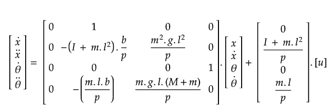
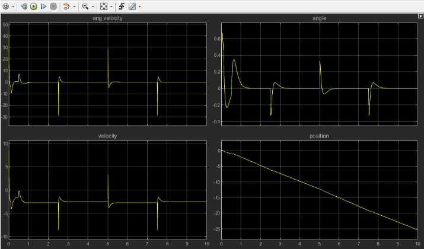
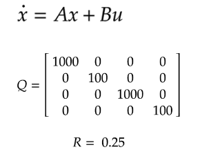
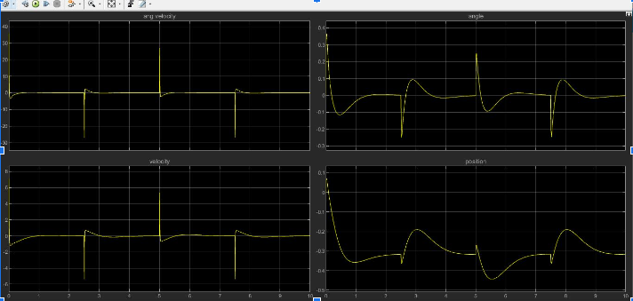

# **Simulation and Comparison Between Controls for Two-Wheeled Self-Balancing Robot in MATLAB/SIMULINK**

**Ranish Devkota**  
**ranish075bei@ioepc.edu.np**

# **ABSTRACT**

A two-wheeled self-balancing robot is an application of the classical inverted pendulum problem of a control system. In this robot, it is obligatory to study control theory and find the best suitable controls for our system. Moreover, it is needed to study the behavior of current in the DC motor models to verify the Control system and end effector trade-off. In this study, The PID controllers is chosen and applied them in various ways, forming various control loops for stabilizing our system and at last studied behavior for one of the optimal controllers called LQR by simulating in MATLAB.

State-space implementation of robot is defined as the following:

 # **Responses**    
The responses  of the simulation are summarized below as

 ` PID Controller `
--

 `LQR Controller`
--
LQR controller is an optimal controller whose motive is to minimize the cost function and make controller more optimal.

The tuning parameter of LQR is defined by 2  variables
	Q Matrix 
	R
 

And The response of Robot is :
--

# **References**

	[1] 	 A.N.K. Nasir, M.A. Ahmad, and M.F. Rahmat , "Performance Comparison between LQR and PID controllers for an Inverted Pendulum System"

	[2]	Int. J. of Applied Mechanics and Engineering, 2017, vol.22, No.3, pp.739-747

	[3]	Jian Fang, "The LQR Controller Design of Two-Wheeled Self-Balancing Robot Based on the Particle Swarm Optimization Algorithm", *Mathematical Problems in Engineering*, vol. 2014, Article ID 729095, 6 pages, 2014.https://doi.org/10.1155/2014/729095 

	[4]	mouad boumediene (2021)." two wheeled self-balancing robot" [https://www.mathworks.com/matlabcentral/fileexchange/88768-two-wheeled-self-balancing-robot](https://www.mathworks.com/matlabcentral/fileexchange/88768-two-wheeled-self-balancing-robot), MATLAB Central File Exchange. Retrieved July 20, 2021\.

	[5]	‘Modeling of Two-wheeled Self-balancing Robot driven by DC gearmotors’  
	Int. J. of Applied Mechanics and Engineering, 2017, vol.22, No.3, pp.739-747 DOI: 10.1515/ijame-2017-0046  

	[6]	‘Modeling, Simulation, and Optimal Control for Two-Wheeled Self-Balancing Robot ‘  
	Modestus Oliver Asali, Ferry Hadary, Bomo Wibowo Sanjaya

	[7]	‘Two wheeled Self-balancing robot’  
	[https://www.mathworks.com/matlabcentral/fileexchange/88768-two-wheeled-self-balancing-robot](https://www.mathworks.com/matlabcentral/fileexchange/88768-two-wheeled-self-balancing-robot)

	[8]	‘Inverted Pendulum: State-Space Methods for Controller Design’  
	[https://ctms.engin.umich.edu/CTMS/index.php?example=InvertedPendulum\&section=ControlStateSpace](https://ctms.engin.umich.edu/CTMS/index.php?example=InvertedPendulum\&section=ControlStateSpace)

	[9]	‘Modeling and Control of a Two Wheeled AutoBalancing Robot: a didactic platform for control engineering education’  
	Fabián R. Jiménez L., MSc. , Ilber A. Ruge R., MSc., and Andrés F. Jiménez L., PhD
